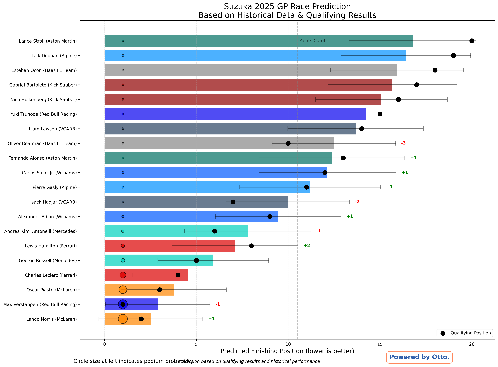
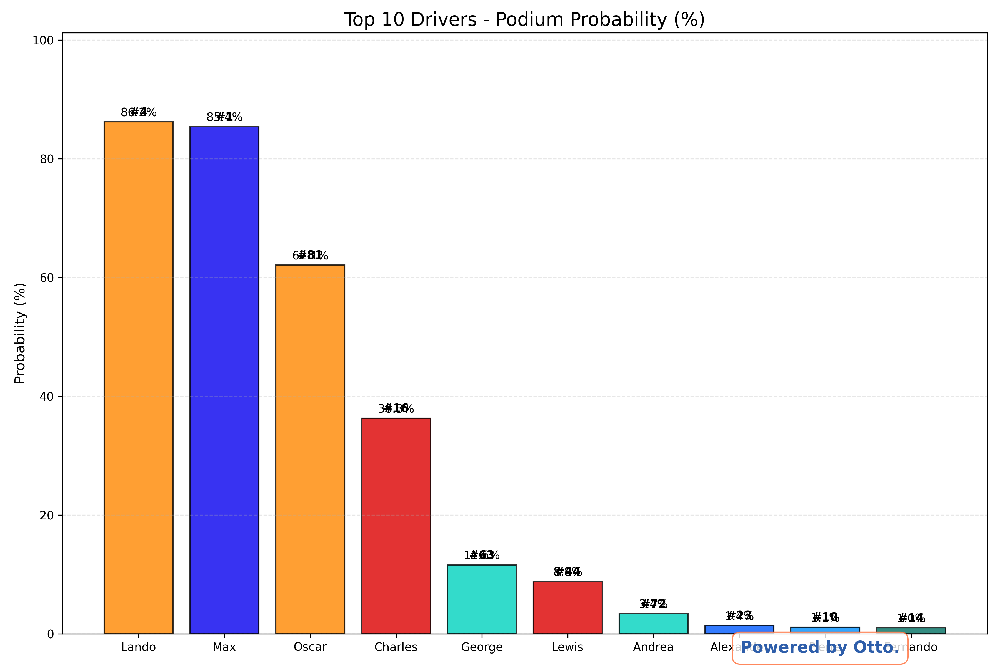

# Suzuka 2025 F1 Prediction Model

### Built for Fans. Backed by Data. Powered by [Otto.rentals](https://otto.rentals)

Welcome to Otto's open-source F1 prediction engine — a machine learning project designed to forecast race results, generate driver insights, and create Instagram/Twitter-ready graphics for Formula 1 fans.

This repo currently supports predictions for the Suzuka and Shanghai Grand Prix in 2025.

---

## What’s Inside

| Module                        | Description                                                                                                                                  |
| ----------------------------- | -------------------------------------------------------------------------------------------------------------------------------------------- |
| `suzuka_f1.py`                | Full-featured simulator for the Suzuka GP. Uses a Random Forest model, historical data, custom heuristics, and outputs 7 social-ready plots. |
| `shanghai_f1.py`              | Predicts results for the Shanghai GP using Random Forest + team/driver embeddings. Includes fallback handling and grid simulation.           |
| `suzuka_2025_predictions.csv` | Ranked table of driver predictions with podium/points probabilities.                                                                         |
| `*.png` images                | Visual outputs (charts, comparisons, podiums) generated by the model for social sharing.                                                     |

---

## Why We Built This

Otto helps car rental businesses go digital. But we’re also car lovers at heart. So we built this to:

- Bring machine learning to Formula 1 race predictions
- Create visual, shareable insights for fans
- Showcase Otto’s technical chops and brand voice

---

## Installation

```bash
pip install fastf1 pandas numpy scikit-learn matplotlib seaborn pillow
```

We recommend using a virtual environment (e.g. `venv` or `conda`) for clean installs.

---

## How to Use

### 1. Predict Suzuka GP

```bash
python suzuka_f1.py
```

Outputs:

- `suzuka_2025_race_prediction.png`: Full grid predictions w/ error bars
- `suzuka_2025_podium_probability.png`: Top podium chances
- `suzuka_2025_points_probability_social.png`: Points finish visual for IG
- `suzuka_2025_driver_comparison.png`: Head-to-head radar chart
- `suzuka_2025_grid_vs_prediction.png`: Quali vs prediction
- `suzuka_2025_team_performance.png`: Team-level performance
- `suzuka_2025_prediction_uncertainty.png`: Prediction risk vs confidence
- `suzuka_2025_predictions.csv`: Tabular output for analysis

---

## Sample Visuals

Here’s a preview of the kinds of outputs we generate:

|  |  |
| :-------------------------------------------------: | :---------------------------------------------------------: |
|                Full Grid Prediction                 |                  Podium Probability Chart                   |

More visuals available in the `*.png` files in the repo. All plots are Otto-branded and social-ready.

---

## Predicted Results for Suzuka 2025

### Podium Finish Prediction

|   Predicted Pos | Driver         | Team            |   Grid Pos |   Avg Finish |   Uncertainty |   Podium % |   Points % |
|----------------:|:---------------|:----------------|-----------:|-------------:|--------------:|-----------:|-----------:|
|               1 | Lando Norris   | McLaren         |          2 |        2.518 |       2.83014 |       86.2 |       95.5 |
|               2 | Max Verstappen | Red Bull Racing |          1 |        2.892 |       2.8419  |       85.4 |       95.2 |
|               3 | Oscar Piastri  | McLaren         |          3 |        3.768 |       2.86957 |       62.1 |       94.5 |

### Full Grid Prediction

|   Predicted Pos | Driver                | Team            |   Grid Pos |   Avg Finish |   Uncertainty |   Podium % |   Points % |
|----------------:|:----------------------|:----------------|-----------:|-------------:|--------------:|-----------:|-----------:|
|               4 | Charles Leclerc       | Ferrari         |          4 |        4.553 |       3.04573 |       36.3 |       93   |
|               5 | George Russell        | Mercedes        |          5 |        5.918 |       3.01237 |       11.6 |       92.4 |
|               6 | Lewis Hamilton        | Ferrari         |          8 |        7.106 |       3.43607 |        8.8 |       87.6 |
|               7 | Andrea Kimi Antonelli | Mercedes        |          6 |        7.805 |       3.43843 |        3.4 |       84.7 |
|               8 | Alexander Albon       | Williams        |          9 |        9.461 |       3.41821 |        1.4 |       67.7 |
|               9 | Isack Hadjar          | VCARB           |          7 |        9.981 |       3.36035 |        0.5 |       65.2 |
|              10 | Pierre Gasly          | Alpine          |         11 |       11.201 |       3.83605 |        1.1 |       45   |
|              11 | Carlos Sainz Jr.      | Williams        |         12 |       12.14  |       3.73341 |        0.5 |       33.5 |
|              12 | Fernando Alonso       | Aston Martin    |         13 |       12.377 |       3.96921 |        1   |       32   |
|              13 | Oliver Bearman        | Haas F1 Team    |         10 |       12.489 |       3.35785 |        0   |       28.6 |
|              14 | Liam Lawson           | VCARB           |         14 |       13.673 |       3.69537 |        0.3 |       20.4 |
|              15 | Yuki Tsunoda          | Red Bull Racing |         15 |       14.239 |       3.76484 |        0.3 |       17.9 |
|              16 | Nico Hülkenberg       | Kick Sauber     |         16 |       15.083 |       3.58678 |        0   |       12.4 |
|              17 | Gabriel Bortoleto     | Kick Sauber     |         17 |       15.68  |       3.50655 |        0.3 |        9.9 |
|              18 | Esteban Ocon          | Haas F1 Team    |         18 |       15.933 |       3.6221  |        0.4 |        9.1 |
|              19 | Jack Doohan           | Alpine          |         19 |       16.404 |       3.5326  |        0.4 |        7.5 |
|              20 | Lance Stroll          | Aston Martin    |         20 |       16.779 |       3.45458 |        0   |        7.9 |

---

## Model Summary

We use a hybrid approach for accuracy + engagement:

- Model Type: Random Forest Regressor (from `sklearn`)
- Training Data: FastF1 results from 2022–2024
- Features:
  - Grid position
  - Track-specific performance
  - Driver form (rolling 5-race average)
  - Team strength (recent trends)
  - Driver experience & special case handling
- Simulations: 1000 Monte Carlo runs per driver
- Extras: Heuristics for rookies, team changes, rain risk, Suzuka experts

---

## File-by-File Breakdown

| File                          | Purpose                                                                         |
| ----------------------------- | ------------------------------------------------------------------------------- |
| `suzuka_f1.py`                | End-to-end race simulation and visual generation for Suzuka GP                  |
| `suzuka_v1.py`                | Race simulation with minimal visuals                                            |
| `suzuka_2025_predictions.csv` | Predicted results (driver, team, average finish, probabilities)                 |
| `*.png`                       | High-res images for use on social platforms like Instagram, X (Twitter), TikTok |
| `README.md`                   | You’re reading it                                                               |

---

## For Non-Technical Readers

You don’t need to understand code to enjoy this:

- We’re using past F1 data to predict who finishes where in future races.
- We simulate 1,000 races based on real qualifying data, driver history, team performance, and random events like crashes or rain.
- The charts help show how confident we are in each prediction (e.g. Verstappen might win, but is he 90% likely or 55%?).
- Think of it as fantasy F1 meets data science.

---

## Built With

- `fastf1` for live/historical race data
- `pandas`, `numpy` for data processing
- `scikit-learn` for modeling
- `matplotlib`, `seaborn`, `pillow` for graphics
- Python 3.9+

---

## Contributions & Replication

We welcome forks and feedback! Try replicating predictions for other 2025 races by:

- Updating `drivers.py` with real qualifying results
- Switching the circuit name and location flags
- Running the script and sharing results

---

## Author

- **Frank Ndungu** – Software Engineer | CX at Otto Rentals

---

## License

This project is licensed under the MIT License. See the `LICENSE` file for details.

---

## Let’s Talk

Love cars? Like data? Run a motorsport or F1 page?

- Let’s collaborate on custom graphics.
- DM [@otto.rentals](https://instagram.com/otto.rentals) on IG or X.
- We can help you bring data storytelling to racing.

---

## Powered by Otto

The SaaS platform digitizing car rentals across Africa.  
We build products for hosts, renters — and now, Formula 1 fans.
